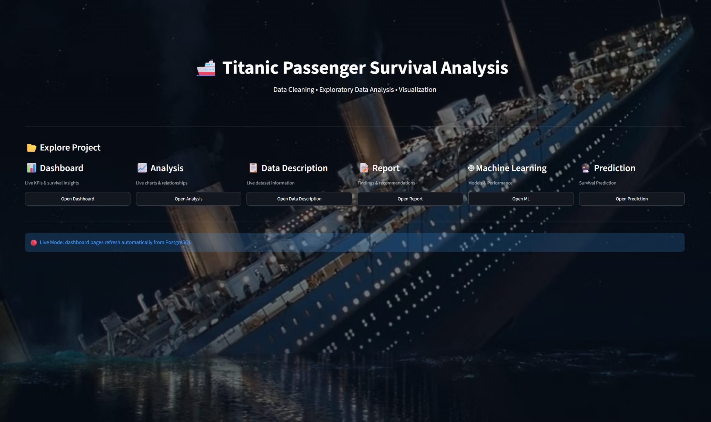

# 🚢 Titanic Passenger Survival Analysis & Machine Learning



An interactive **Titanic Survival Analysis and Machine Learning** project built with Python, Streamlit, PostgreSQL, and Scikit-learn.

The project combines data cleaning, exploratory data analysis, visualization, machine learning model comparison, and an interactive survival prediction page in one Streamlit application.

## 🚀 Live Demo

**Streamlit App:**  
[🔗 Titanic Survival Analysis & ML Dashboard](https://titanic-survival-analysis-ml.streamlit.app)

---

## 📌 Project Features

### 📊 Dashboard
- Passenger survival KPIs
- Interactive dashboard
- Survival insights
- PostgreSQL live data integration

### 📈 Analysis
- Exploratory Data Analysis (EDA)
- Survival relationships and patterns
- Data visualizations
- Passenger demographics analysis

### 📋 Data Description
- Dataset overview
- Feature descriptions
- Data structure and variables

### 📝 Report
- Key analytical findings
- Important survival factors
- Recommended actions and conclusions

### 🤖 Machine Learning
Five classification models were trained and compared:

- Random Forest
- Decision Tree
- Logistic Regression
- XGBoost
- CatBoost

The Machine Learning page includes:
- Accuracy
- Precision
- Recall
- F1 Score
- Model comparison
- Accuracy comparison chart
- Confusion matrices
- CatBoost classification report

### 🔮 Survival Prediction
The project also includes a dedicated **Prediction** page.

Users can enter passenger information such as:
- Passenger Class
- Sex
- Age
- Number of Siblings/Spouses
- Number of Parents/Children
- Fare
- Embarked Port

The application automatically applies the required preprocessing, including:

- Label Encoding
- Standard Scaling
- Feature preparation

Then the trained CatBoost model predicts whether the passenger is:

**🟢 Likely to Survive**  
or  
**🔴 Likely Not to Survive**

The prediction page also provides a visual probability/result display.

---

## 🧹 Data Cleaning

The dataset was cleaned before analysis and modeling.

Main steps:

- Handling missing Age values using the median
- Handling missing Embarked values using the mode
- Removing the Cabin column
- Removing duplicate records
- Converting Embarked codes into readable names
- Removing unnecessary columns such as PassengerId, Name, and Ticket for machine learning

---

## 🤖 Machine Learning Results

| Model | Accuracy |
|---|---:|
| Random Forest | 78.21% |
| Decision Tree | 79.33% |
| Logistic Regression | 80.45% |
| XGBoost | 81.56% |
| **CatBoost** | **82.68%** |

### 🏆 Best Model

**CatBoost** achieved the highest accuracy of approximately **82.68%** on the test set.

---

## 🛠️ Technologies Used

- Python
- Pandas
- NumPy
- Matplotlib
- Seaborn
- Plotly
- Scikit-learn
- XGBoost
- CatBoost
- PostgreSQL
- SQLAlchemy
- Streamlit

---

## 📂 Project Structure

```text
Titanic_Project/
│
├── app.py
├── README.md
├── requirements.txt
├── .gitignore
├── titanic.jpg
├── project-preview.png
│
└── pages/
    ├── 1_Dashboard.py
    ├── 2_Analysis.py
    ├── 3_Data_Description.py
    ├── 4_Report.py
    ├── 5_Machine_Learning.py
    └── 6_Prediction.py
```

---

## 🗄️ Database

The project uses **PostgreSQL** to load Titanic data dynamically.

The Streamlit application can refresh the dataset from PostgreSQL using the refresh functionality.

> Note: A local PostgreSQL database using `localhost` is available only on the local machine. For public Streamlit deployment, the database connection must be changed to a hosted database or another accessible data source.

---

## 🎯 Project Goal

The goal of this project is to demonstrate a complete data analysis and machine learning workflow:

**Data → Cleaning → EDA → Visualization → SQL/PostgreSQL → ML → Model Evaluation → Prediction**

---

## 👨‍💻 Author

**Abdelaziz Elshourbgy**

Computer Science Student | AI & Data Science Enthusiast

